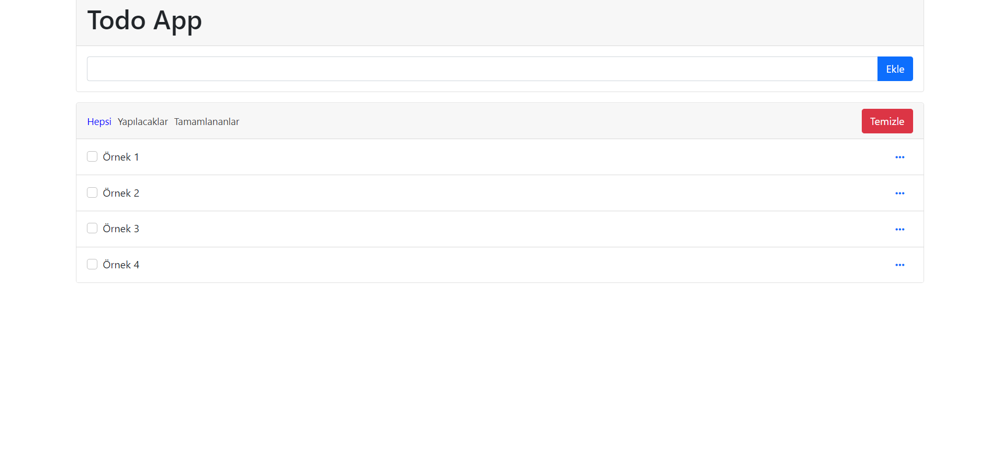
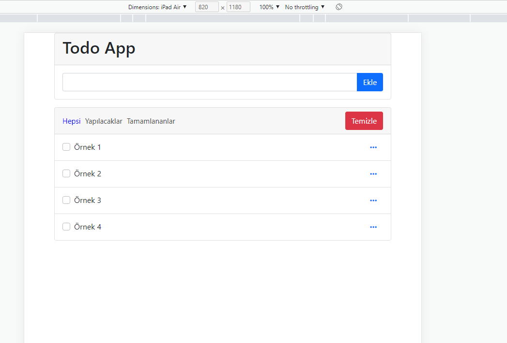
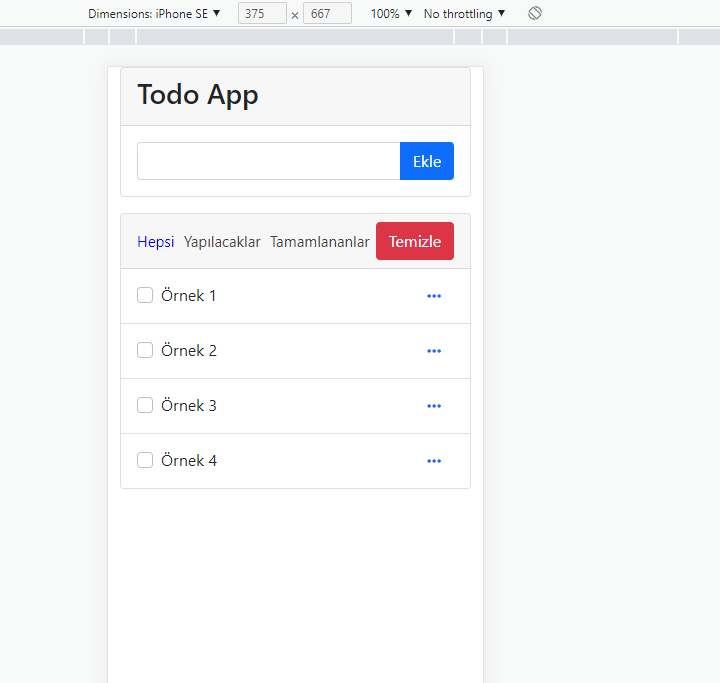

# TODO LIST

Gün içerisinde yapılacak işlerin hatırlanması için kullanılabilecek verimli bir uygulama.
Yapılacak işlerin arasında kaybolan insanların daha verimli bir gün geçirmelerine yardımcı
olmayı amaçlar. Stillendirme için Bootstrap 5 kullandım. Iconlar için Fontawesome kullanmayı
tercih ettim. Depolama için tarayıcıdaki localstorage'i kullandım. Cihaz uyumluluğu için
responsive çalışmaya özen gösterdim. Projemin task ekleme, düzenleme ve silme gibi fonksiyonları bulunuyor.
Projemi sürekli yeni teknolojilerle geliştirmeye devam edeceğim.

## Kullanılan Teknolojiler

**İstemci:** Bootstrap, Fontawesome

  
## Ekran Görüntüleri

  
## Ekler

Bu projeyi geliştirmemi sağlayan Sadık Turan hocama teşekkür ederim.

  